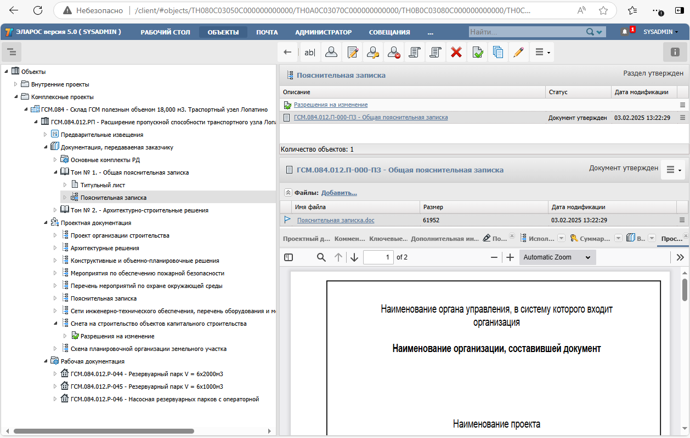
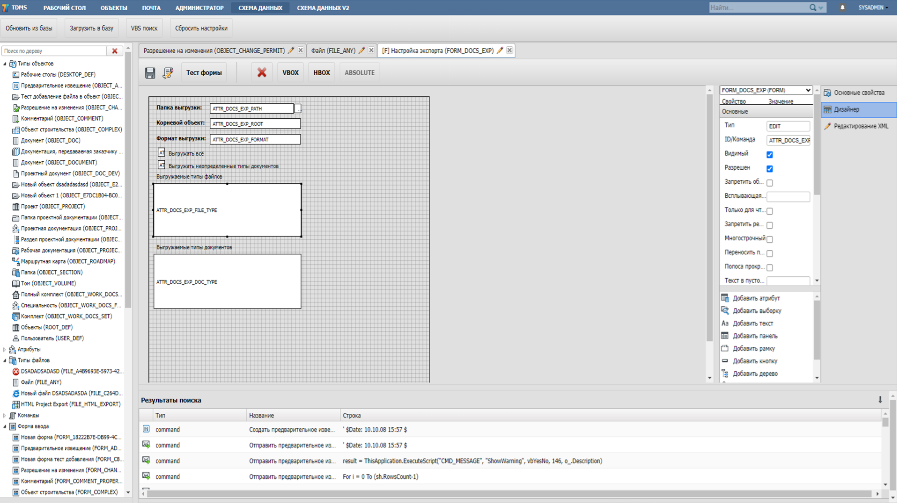
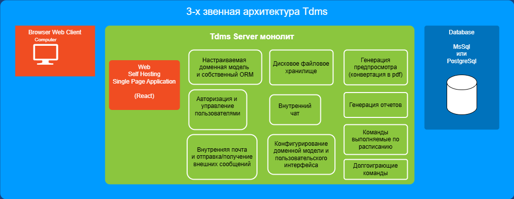

# Общее описание информационной системы Tdms

Система TDMS предназначена для управления информационными потоками и электронной документацией проектных, конструкторских, производственных организаций и любых других предприятий, в работе которых используются технические данные и создаваемые на их основе документы: чертежи, планы, схемы, спецификации, ведомости и т.п.
Основным ядром Tdms является монолитный модуль построенные по 3-х звенной архитектуре.
WebClient - Server - Db.

 

+ Система является конфигурируемой и расширяемой. Т.е. можно создавать доменные сущности, формы ввода и автоматизировать бизнес процессы во встроенном редакторе на языке vbs.

 

+ Система позволяет хранить и управлять файлами (файлы хранятся не в бд, а в дисковом хранилище), конвертировать форматы и генерировать предпросмотр.
+ Система имеет встроенную почту и чат.
+ Система имеет авторизацию и управление правами пользователей.

Т.о. система является архитектурным прототипом для построения систем документооборота и содержит основные функции присущие таким системам и возможность расширения доменной модели для предметной области.

 

