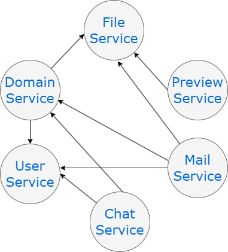

# Примеры необходимых микросервисов

+ **Основная доменная модель и пользовательские расширения**

    Основная доменная бизнес модель и бизнес сервисы. Расширяется и настраивается разработчиками конфигурации.
    На первом этапе предполагается оставить в одном микросервисе(в силу того, что архитектура расширяемой части имеет api и сильную связность).

+ **Управление пользователями**

    Сервис управляет авторизацией пользователей. Хранит информацию о пользователях, группах, подразделениях, должностях. Возможна синхронизация с доменами.

+ **Почта**

    Сервис управляет внутренней почтой, а также позволяет отправлять и получать почту на внешние адреса. Позволяет прикреплять к письму внешние файлы, ссылки на объекты системы.

+ **Чат**

    Сервис представляет собой чат для внутреннего использования. Позволяет прикреплять картинки, файлы и объекты системы к сообщениям. А так же загружать внешние файлы.

+ **Хранение тел файлов**

    Файлы храняться не в БД, а дисковом файловом хранилище, чтобы снять нагрузку с БД и иметь возможность выносить хранилища ближе к пользователю.

+ **Генерация предпросмотра**

    Для отображения содержимого файлов используется предпросмотр png/pdf. Генерация может занимать определенное время и влиять на загрузку сервера.    

+ **Планировщик команд запускаемых по расписанию**

    В системе присутствуют выполняющиеся долго команды, например генерация отчётов, и команды выполняющиеся по расписанию, например экспорт, создание бэкапов.

## Взаимодествие выделенных микросервисов:

 

### 2 базовых сценария работы с системой

Редактирование карточки объекта

1) Пользователь авторизуется
2) Открывает карточку объекта
3) Загружает файл в виде .doсx документа (асинхронно)
4) Видит предпросмотр в виде jpeg/pdf (асинхронно)
5) Сохраняет объект

Создание и отправка письма

1) Пользователь авторизуется
2) Открывает диалог редактирования письма
3) Прикрепляет объект системы в качестве вложения (синхронно)
4) Добавляет внешний файл к письму в качестве вложения (асинхронно)
3) Выбирает пользователей получателей (синхронно)
4) Добавляет в поле сc внешний email
5) Наживает отправить письмо
6) Система отправляет внутренний email пользователям системы и внешний email
через imap на внешние mail сервера (асинхронно)

