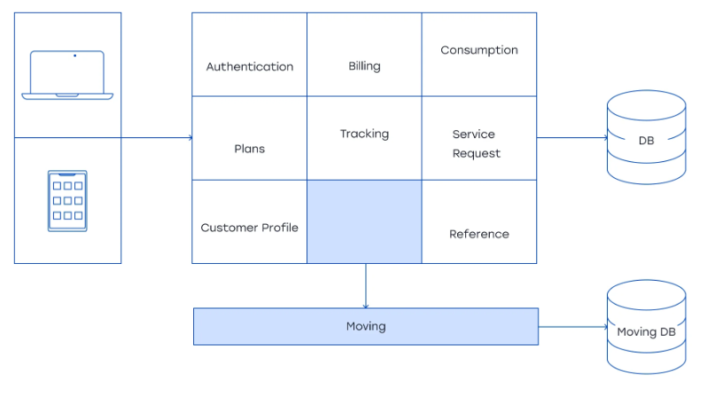
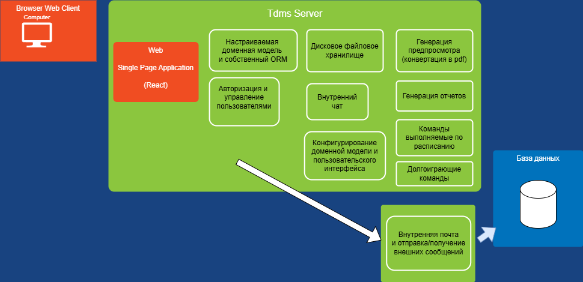
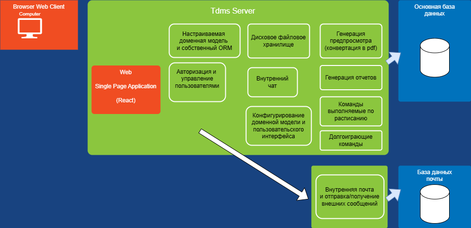
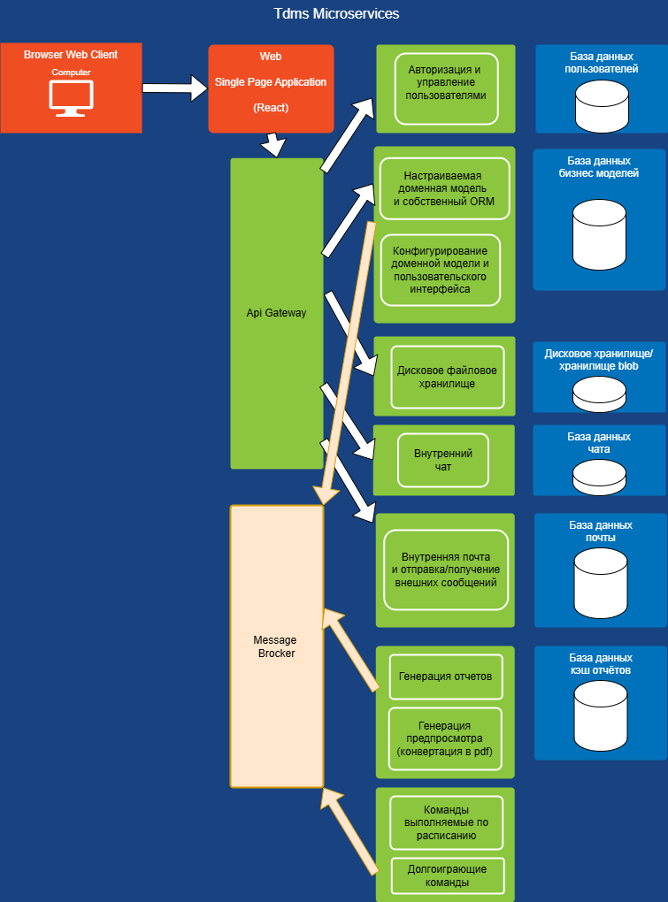

# Разбиение монолита на микросервисы по паттерну Strangler 

Мартин Фаулер, создатель паттерна Strangler, рекомендует преобразовать монолит вначале в модульный монолит, а затем в микросервис.

 

Рассмотрим выделение микросервиса на примере почтового сервиса.

## План миграции сервиса работы с почтовыми сообщениями

### Этап 1. Выделение функционала в отдельный модуль

1) Выделить из ORM системы все сущности, которые относятся к почте  
Классы моделей:
+ **MailMessage** - информация о письме и тело  
+ **MailFolder** - почтовая папка.  
2) Создать отдельный репозитория для работы с почтовыми сущностями
    **IMailRepository**.
3) Выделить операции отправки почты в отдельный класс сервиса
    **IMailService**.
4) Выделить отдельный сервис **IUserService**, который сможет по id пользователя получать почтовый адрес и наоборот.
5) Выделить отдельный сервис **IFileService**, который сможет сохранять и загружать тела файлов в хранилище из IStream в определенный fileId.
6) Создать отдельный проект **MailServiceModule** и перенести выделенные классы.
7) Написать unit и mock тесты, проверяющие работу доменной модели и сервисов работы с почтой.
8) Подключить модуль **MailServiceModule** как dll reference к основному проекту, изменить регистрацию сервисов в IoC контейнере с базовых на сервисы модуля
(модуль по прежнему работает в единой базе данных, но со своими таблицами).

**Условия перехода на этап**

1) Основной код работает через интерфейсы. 
2) Интерфейсы не имеют прямой связи друг с другом.
3) Новый модуль протестирован unit и mock тестами.
4) Возможно легкое переключение реализаций ядро-модуль.

**Развертывание**

Поднимаем экземпляр сервера на новой архитектуре и направляем туда пользователей одного отдела/подразделение(~10% пользователей).

**План на случай проблем**

1) Приостанавливаем следующие этапы
2) Возвращаем старую реализацию интерфейсов сервисов
3) Чиним новые сервисы, либо пересматриваем архитектуру

### Этап 2. Добавление http rest Api. Переход на внешний микросервис.

 

1) Добавить в модуль **MailServiceModule** независимый rest http controller, для создания, удаления, отправки почты, изменения структуры почтовых папок(В dto моделях rest api имеется только ограниченная информация о моделях других сервисов. Например для пользователя только id и email, а для файлов только имя и fileId хранилища тела файла).
2) Разделить в модуле **MailServiceModule** таблицы базы данных работы с почтой, т.о. чтобы они были независымыми и их можно было перенести в другую бд. Сделать миграции. 
3) Запустить **MailServiceModule** как отдельный сервер, протестировать http и написать unit тесты контроллеров.
4) Перенаправить запросы с http api почты основного сервера на сервер **MailService**.
5) Настроить одновременное развертывание в docker/kubernates обоих серверов.
6) Протестировать систему целиком интеграционными тестами.

**Условия перехода на этап**

1) Создан и протестирован http restApi.
2) Таблицы базы данных относящиемя в сервису посты полностью независимы.
3) Настроены скрипты развертывания обоих серверов.
4) Протестирована система на тестовом стенде.

**Развертывание**

1) Обновляем экземпляр сервера развернутого на прошлом этапе до новой конфигурации, в которой почта работает через http.
2) Развертываем оба сервера и подключаем для тестирования ещё один/несколько отделов/подразделений.
3) В случае успешной эксплуатации переводим всех пользователей на новую систему.

**План на случай проблем**

1) Вернуться к предыдущей конфигурации одного сервера и модуля.

### Этап 3. Выделение таблиц в отдельную базу данных

1) Настроить микросервис для работы с отдельной базой данных.
2) Написать и протестировать конвертеры одной базы в другую.
3) Протестировать систему на тестовом стенде.
4) Скопировать актуальные таблицы в новую БД.

 

**Условия перехода на этап**

1) Тестовый запуск работает успешно.
2) Скрипты переноса протестированы.
3) Актуальные таблицы почты скопированы в новую базу данных.
4) Прошлые этапы прошли успешно, сервисы работают и все ошибки исправлены.

**Развертывание**

1) Обновляем сервера полностью на работу с новой базой данных.

**План на случай проблем**

1) Вернуться к предыдущей конфигурации.

### Этап 4. Завершающий

1) В случае успешной тестовой эксплуатации, полностью отключить и удалить прямые вызовы сервисов почты. Далее работаем только через http Api шлюз.
2) Если из основного api потребуется рассылка почты, можно отправлять её через http на микросервис, либо подключить очередь сообщений и посылать команды туда(mail сервис будет слушать и рассылать сообщения).

### Результат

В последствии, вынести **фронт**, **api gateway** на отдельный сервер, и проделать аналогичные операции для остальных модулей. Заменить часть прямых http запросов на асинхронные события и подключить **message brocker**. Получим микросервисную архитектуру

 
